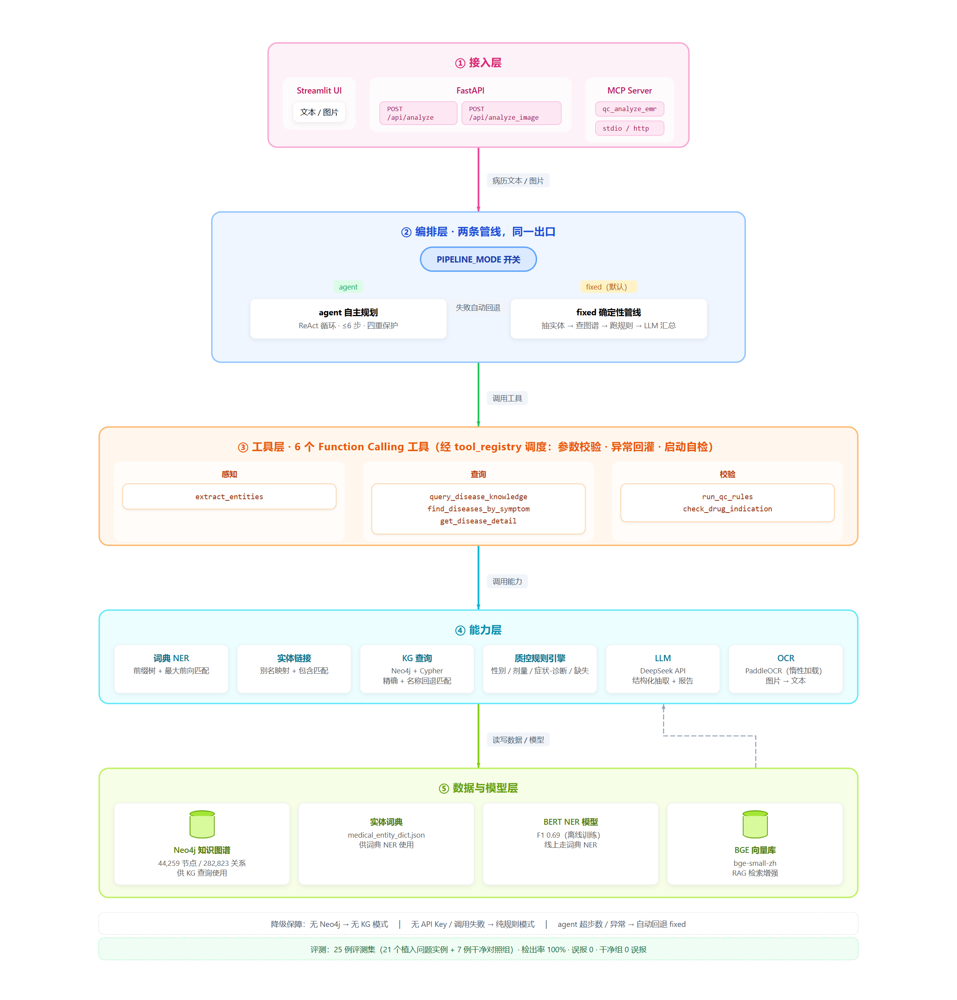

# 🏥 MedGuardian — 智能病历结构化 + 质控 Agent

> 输入一份中文电子病历 → AI 自动提取关键医疗实体 → 基于医学知识图谱检测临床逻辑矛盾 → 输出结构化质控报告。

[](https://www.python.org/)
[](LICENSE)
[]()

---

## ✨ 特性

- **多模态输入**：文本病历 + 图片病历（PaddleOCR 识别）
- **医疗实体识别**：**线上**采用词典匹配（前缀树 + 最大前向匹配）+ 实体链接，识别疾病/症状/药品/检查等 9 类实体；**离线**另训有 `bert-base-chinese` 微调 NER 模型（实体级验证集最佳 F1 0.69），作为后续双路融合方案
- **知识图谱增强（RAG）**：Neo4j 本地知识图谱（4.4 万节点/28 万关系），实体链接 + 图谱检索增强 LLM 生成
- **向量检索 RAG**：BGE embedding + chunk 切分 + 余弦相似度检索 + LLM 生成（完整检索增强生成链路）
- **LLM 深度质控**：DeepSeek API 驱动，发现规则引擎无法识别的临床逻辑问题（症状-性别矛盾、用药-诊断不匹配等）
- **规则引擎兜底**：性别矛盾/剂量异常/症状匹配/信息完整性四级检测，服务异常自动降级不崩溃
- **Agent 自主规划（ReAct）**：6 个 Function Calling 工具由模型自行决定「调哪个、拿什么参数调」；四重保护（参数校验 / Schema↔实现启动自检 / `max_steps` 防死循环 / 工具异常回灌为 Observation 让模型自我修正）；`PIPELINE_MODE=fixed|agent` 双管线，Agent 异常自动回退 fixed，两条管线输出同一份结构化报告
- **工程化交付**：FastAPI + Streamlit + Docker；接口实测 246ms 返回完整报告（含 Neo4j 图谱查询往返），纯规则链路实测 0.3ms
- **质控规则评测集**：25 例带已知答案的评测集（18 例含植入问题、共 21 个问题实例 + 7 例干净对照组），输出检出率 / 误报率 / 完全正确数 / 延迟基线；当前 rule-only 模式下检出率 100%、误报 0、对照组 0 误报
- **MCP Server**：基于 MCP 协议把整体质控能力封装为可调用工具（stdio transport），打通 Agent 与病历 / 知识库数据源；Neo4j 不可达自动降级，任意环境可跑

---

## 🏗 技术架构



五层结构 **接入 → 编排 → 工具 → 能力 → 数据**：

- **编排层**（`src/agent/pipeline.py`）是统一入口，按 `PIPELINE_MODE` 在 `fixed` 确定性管线与 `agent` ReAct 自主规划之间切换；
- **工具层** 6 个 Function Calling 工具是统一出口，经 `tool_registry` 做参数校验与启动自检；
- **能力层 / 数据层** 解耦，任一依赖不可达都走降级路径（无 Neo4j → 无 KG 模式；无 API Key → 纯规则模式；Agent 超步数/异常 → 回退 fixed，任何情况下都有结果产出）。

| 模块 | 技术 |
|------|------|
| NER | **线上**：词典匹配（前缀树 + 最大前向匹配）+ 实体链接；**离线**：`bert-base-chinese` 微调（HuggingFace Token Classification，实体级 F1 0.69） |
| 实体链接 | 别名映射 + 包含匹配 |
| 知识图谱 | Neo4j + Cypher（4.4 万节点 / 28 万关系）；查询做「名称回退匹配」（通用名↔商品名、词典用词↔图谱用词）+ 一致性三态判定（未收录 ≠ 不符） |
| RAG | BGE embedding + 向量检索 + 知识图谱增强 |
| LLM 应用 | DeepSeek API（OpenAI 兼容格式）+ ReAct 自主规划（6 个 Function Calling 工具）+ `PIPELINE_MODE=fixed\|agent` 双管线与降级 |
| OCR | PaddleOCR |
| 后端 | FastAPI |
| 前端 | Streamlit |
| 部署 | Docker |

---

## 🚀 快速开始

### 环境要求

- Python 3.10+
- Neo4j（本地或远程）

### 安装

```bash
git clone https://github.com/qweq-cell/medical-qa-agent.git
cd medical-qa-agent

pip install -r requirements.txt
# 可选：图片识别
# pip install paddlepaddle paddleocr
```

### 配置

1. （可选）导入知识图谱，启用 KG 增强（完整复现 44K 节点 / 280K 关系图谱）：

   KG 源数据 `medical.json`（约 45MB，JSONL，8808 条疾病记录）来自第三方开源医疗知识图谱项目
   [zhihao-chen/QASystemOnMedicalKG](https://github.com/zhihao-chen/QASystemOnMedicalKG)
   （上游 [liuhuanyong/QABasedOnMedicalKnowledgeGraph](https://github.com/liuhuanyong/QABasedOnMedicalKnowledgeGraph)），
   因体积较大不随本仓库分发。请先从上述项目（或其 fork）获取构建好的 `medical.json` 放到本仓库：

   ```
   data/QASystemOnMedicalKG/data/medical.json
   ```

   然后启动本地 Neo4j 并执行导入（幂等 MERGE，可重复运行）：

   ```bash
   pip install neo4j
   python scripts/import_medical_kg.py --password <your-neo4j-password>
   ```

   > 未放置该文件也能正常演示：系统自动降级为「无 KG 模式」，词典 NER + 规则质控完整可用。

2. （可选）LLM 深度质控：复制 `.env.example` 为 `.env` 并填入 DeepSeek API Key：

   ```
   LLM_API_KEY=sk-xxx
   ```

### 运行

```bash
# 方式一：一键启动（后端 + 前端）
start-demo.bat

# 方式二：分别启动
python -m src.main                          # 后端 API (8000)
streamlit run src/ui/app.py                 # 前端 (8501)
```

浏览器访问 `http://localhost:8501`，输入病历文本或上传图片，点击「分析」。

### 评测

```bash
# 跑 25 例质控规则评测集，输出 recall / 误报率 / 延迟分位数
python eval/run_eval.py            # 写 eval/report.md
python eval/run_eval.py --json     # 仅打印 JSON 汇总
```

### API

| 接口 | 说明 |
|------|------|
| `POST /api/analyze` | 分析病历文本，返回结构化质控报告 |
| `POST /api/analyze_image` | 上传病历图片，OCR 识别后分析 |
| `GET /api/health` | 健康检查 |

---

## 📁 项目结构

```
src/
├── ner/        # 实体识别（词典匹配 + 实体链接）
├── kg/         # 知识图谱（Neo4j 连接 + Cypher 查询）
├── llm/        # LLM 应用（DeepSeek 客户端 + 结构化抽取 + 质控报告）
├── ocr/        # 图片识别（PaddleOCR）
├── qc/         # 质控规则引擎 + 报告生成
├── agent/      # 编排层（ReAct 循环 + 工具注册表 + 双管线调度）
├── api/        # FastAPI 路由
├── ui/         # Streamlit 前端
├── models/     # 数据模型（Pydantic）
└── main.py     # 应用入口
scripts/        # 数据导入 / NER 训练 / RAG demo
models/         # 预训练 + 微调模型权重
data/           # 数据集（CMeEE / 医疗知识图谱数据）
eval/           # 质控规则评测集（cases.json + runner + 评测报告）
mcp-server/     # MCP Server（stdio，把质控能力暴露为 MCP 工具）
```

---

## 📊 项目里程碑

- ✅ 医疗 NER 模型**离线训练**（bert-base-chinese 微调，CMeEE-V2 全量 1.5 万条，5 epoch，实体级验证集最佳 F1 0.69）
- ✅ 本地知识图谱构建（44K 节点 / 280K 关系）
- ✅ LLM 接入（DeepSeek，规则兜底 + 自动降级）
- ✅ OCR 图片识别 + 向量检索 RAG
- ✅ FastAPI + Streamlit + Docker 全链路 Demo
- ✅ 质控规则评测集（25 例 + 对照组 + 自动化 runner，输出 recall / 误报率 / 延迟基线）
- ✅ MCP Server（stdio transport，质控能力工具化）
- ✅ Agent 自主规划改造（工具 3 → 6 个，ReAct 循环 + 四重保护 + `PIPELINE_MODE=fixed|agent` 双管线与自动回退）

---

## 📄 License

[MIT](LICENSE)

---

> 📅 项目开始：2026 年 7 月 | 医疗 AI 应用方向个人项目
